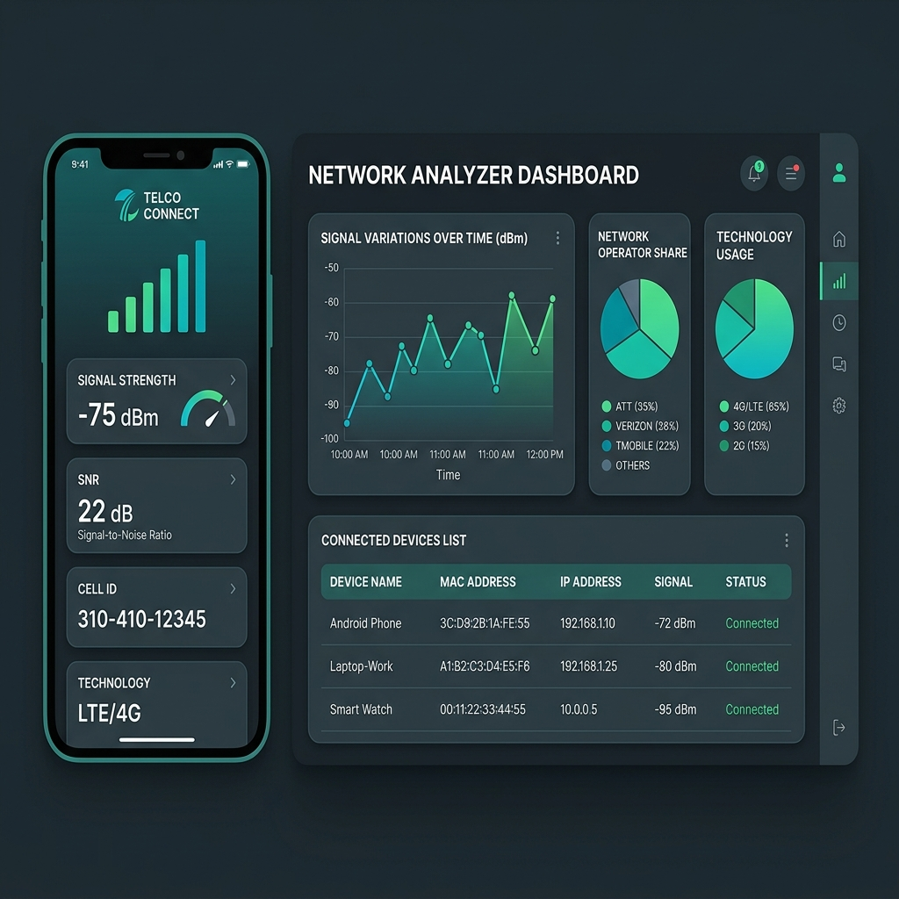

# Client-Server Cellular Network Diagnostics & Analytics Dashboard

A comprehensive, client-server diagnostics system that collects, logs, and visualizes real-time mobile cellular telemetry. The system consists of an **Android App Client** that polls cellular parameters and sends them via HTTP POST, and a **Python Flask Web Server Dashboard** that aggregates and computes network statistics.

---

## 🎨 User Interface Dashboard
Below is a high-fidelity visual mockup of the mobile diagnostic app (left) and the web statistics dashboard (right):



---

## 📋 Table of Contents
1. [System Architecture](#-system-architecture)
2. [Client App (Android/Java)](#-client-app-androidjava)
3. [Server Dashboard (Flask/Python)](#-server-dashboard-flaskpython)
4. [Repository Structure](#-repository-structure)
5. [Database Schema](#-database-schema)
6. [API Endpoints](#-api-endpoints)
7. [Installation & Setup](#-installation--setup)

---

## 🛠 System Architecture
The system adopts a client-server configuration:
1.  **Mobile Client (Android)**: Acts as the edge collector. Uses Telephony APIs to poll cell information, signal strength, and network parameters.
2.  **Telemetry Transmission**: Sends JSON telemetry payloads over HTTP.
3.  **Backend Server (Flask)**: Processes telemetry payloads, manages SQLite storage, performs data aggregation (average power, network type distributions), and serves a web dashboard.

---

## 📱 Client App (Android/Java)
The client is a native Java Android application built using Gradle.
*   **Telephony Polling**: Uses Android's `TelephonyManager`, `CellInfo`, and `SignalStrength` classes to retrieve cellular parameters.
*   **Metrics Collected**:
    *   Network Operator Name (e.g., Verizon, Orange)
    *   Signal Strength (in dBm / ASU)
    *   Signal-to-Noise Ratio (SNR)
    *   Network Type (LTE, UMTS, HSPA, etc.)
    *   Frequency Band & Cell ID
    *   Device MAC address and IP Address
*   **Networking**: Sends payloads via Java's HTTP client requests to the server.

---

## 💻 Server Dashboard (Flask/Python)
The server is built with Python, Flask, and SQLite.
*   **Data Aggregation**: Summarizes signal variations over custom time intervals.
*   **Active Device Tracker**: Uses client MAC addresses and timestamp differentials to calculate currently connected devices in real time.
*   **Web Console**: Integrates a HTML/CSS user interface (`page.html`) showing active MAC mappings and statistical distributions of operator performance.

---

## 📂 Repository Structure
```text
Network-Cell-Analyzer/
├── MyApplication6/           # Android Studio Gradle Project
│   ├── app/
│   │   ├── src/main/
│   │   │   ├── java/         # Telephony poller and HTTP poster logic
│   │   │   └── AndroidManifest.xml # Network & location permission declarations
│   │   └── build.gradle      # App compilation dependencies
│   ├── gradlew / gradlew.bat # Gradle compilation scripts
│   └── settings.gradle       # Gradle project settings
├── networkapp_server/        # Flask API Server
│   ├── instance/
│   │   └── mydb.sqlite       # Local SQLite storage file (git ignored)
│   ├── static/               # CSS, JS, and asset resources
│   ├── templates/home/
│   │   └── page.html         # Admin dashboard template interface
│   └── app.py                # Flask controller, API routing, and DB logic
├── screenshots/
│   └── dashboard_mockup.png  # Dashboard mockup layout
├── requirements.txt         # Server dependencies
└── README.md                # System documentation
```

---

## 📊 Database Schema

The database (`mydb.sqlite`) stores logged telemetry under the `cell_info` table:

| Column | Type | Constraints | Description |
|---|---|---|---|
| **id** | `INTEGER` | Primary Key, Auto-Increment | Entry identifier |
| **operator** | `TEXT` | Not Null | Network carrier name |
| **signal_strength** | `INTEGER` | Not Null | Cell signal strength in dBm |
| **SNR** | `TEXT` | Not Null | Signal-to-noise ratio parameter |
| **network_type** | `TEXT` | Not Null | Access technology (LTE, HSPA, etc.) |
| **frequency_band** | `TEXT` | Not Null | Network frequency band |
| **cell_id** | `TEXT` | Not Null | Connected cell transceiver ID |
| **timestamp** | `TEXT` | Not Null | Client-side timestamp |
| **mac_address** | `TEXT` | Not Null | Client MAC address |
| **ip_address** | `TEXT` | Not Null | Client IP address |
| **created** | `TIMESTAMP` | Default CURRENT_TIMESTAMP | Server insertion timestamp |

---

## 📡 API Endpoints

| Method | Endpoint | Description | Payload |
|---|---|---|---|
| `POST` | `/add_network_info` | Inserts a new diagnostic record | JSON telemetry payload |
| `GET` | `/network_info` | Lists all stored logs sorted by time | None |
| `GET` | `/connected_devices` | Returns count of active clients (last 5s) | None |
| `GET` | `/device_list` | Lists all unique MAC addresses mapped to IPs | None |
| `GET` | `/device/<mac>` | Fetches the latest log from a specific MAC | None |
| `POST` | `/get_statistics` | Calculates stats between start and end dates | JSON `{"start_datetime": "...", "end_datetime": "..."}` |
| `GET` | `/server_interface` | Renders the HTML stats dashboard console | None |

---

## 🚀 Installation & Setup

### 1. Flask Backend Setup
```bash
# Navigate to backend server directory
cd Network-Cell-Analyzer

# Create virtual environment
python -m venv .venv
source .venv/bin/activate  # On Windows: .venv\Scripts\activate

# Install dependencies
pip install -r requirements.txt

# Run the Flask server (runs on port 5000 by default)
python networkapp_server/app.py
```

### 2. Android Client Compilation
1.  Open **Android Studio**.
2.  Select **Open an Existing Project** and choose the `MyApplication6/` directory.
3.  Ensure the target server IP address in the Java source files (telemetry configuration class) points to your running Flask server (e.g., `http://<your-server-ip>:5000/add_network_info`).
4.  Enable **Developer Mode** and **USB Debugging** on a physical Android phone containing a SIM card.
5.  Press **Run** inside Android Studio to compile and deploy the app.
